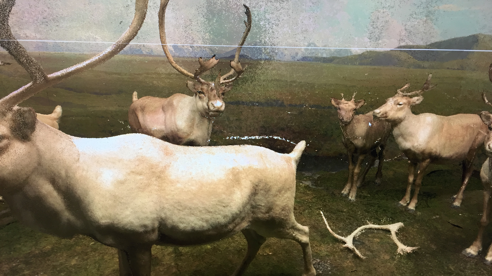

# Progress
Over the past week the team has skilled up on Unity and Autodesk Recap. Using autodesk recap the team could visulize the point cloud data of the Caribou exhibit which was scanned by the Lecila BLK 360. 

 

# Challenges
The point cloud data generated is quite large. In order for us to import the point cloud data into Unity or Unreal the data needs to be converted to a certain format. Unity uses a plugin called pcx which reads only PLY format files, which can't be generated by Autodesk Recap. Unreal engine uses a plugin called the Point Cloud Plugin, which supports LAS, TXT and XYZ. These formats are also not supported by Autodesk Recap.

# Next Steps

The action items for the next week.
 
- Acquire system privileges to install unreal engine, cloud compare and other plugins.

- Import the point cloud data into unity/unreal.

- View the point cloud scene in VR using HTC Vive.
