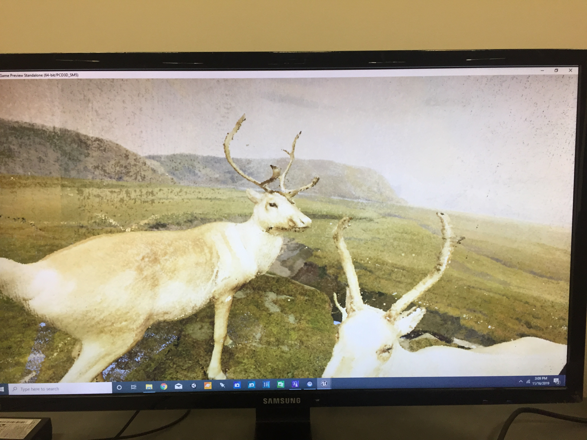
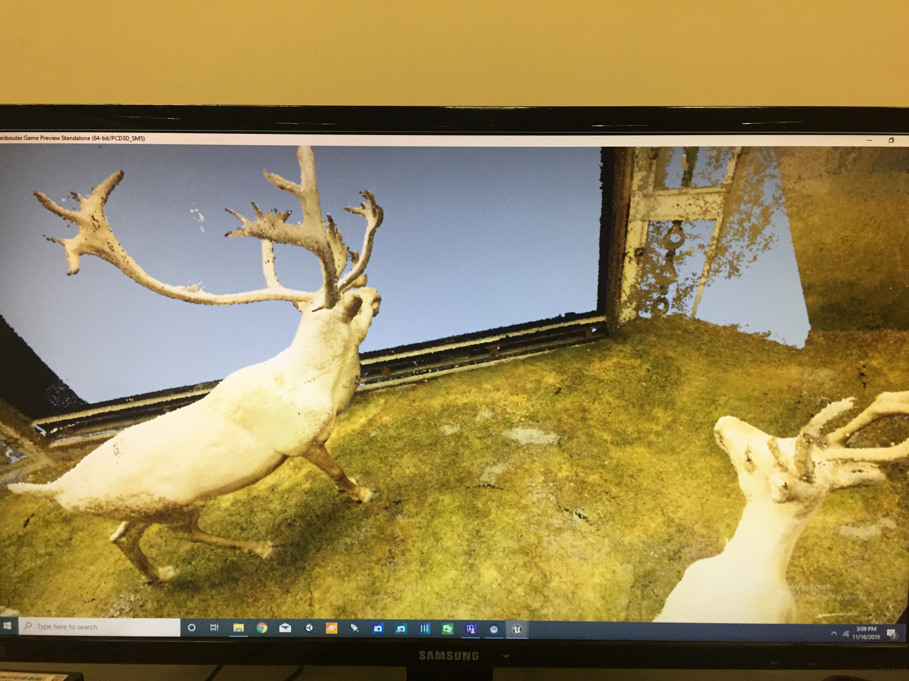

# Progress
The team visited the NHM on the 13th of November to perform 15 scans of the Mountain Goat Exhibit. Apart from that photogrammetry of the caribou exhibit was also performed. On the VR side, we improved the quality of the caribou diorama by increasing the number of rendered points from 1 Million to 10 Million. In order to provide a more natural coloration to the exhibit we adjusted the RGB and Alpha channels along with the light intensity of the scene in Unreal. In an effort to depict climate change we created a mesh of the background point cloud data.

# Challenges
The mesh creation from point cloud is not well documented, involving multiple trails and errors. Once the mesh was obtained, its rendering and alteration is computationally intensive due to the lack of optimized application. 

# Next Steps
- Archive Leica Scans to Cyclone 360.

- Extract texture from the mesh object. Create new texture and apply to the mesh object.

- Introduce the mesh object into the VR scene and change the textures on a trigger.

- Work on Sound/Narration and Particle effects in Unreal engine. 
