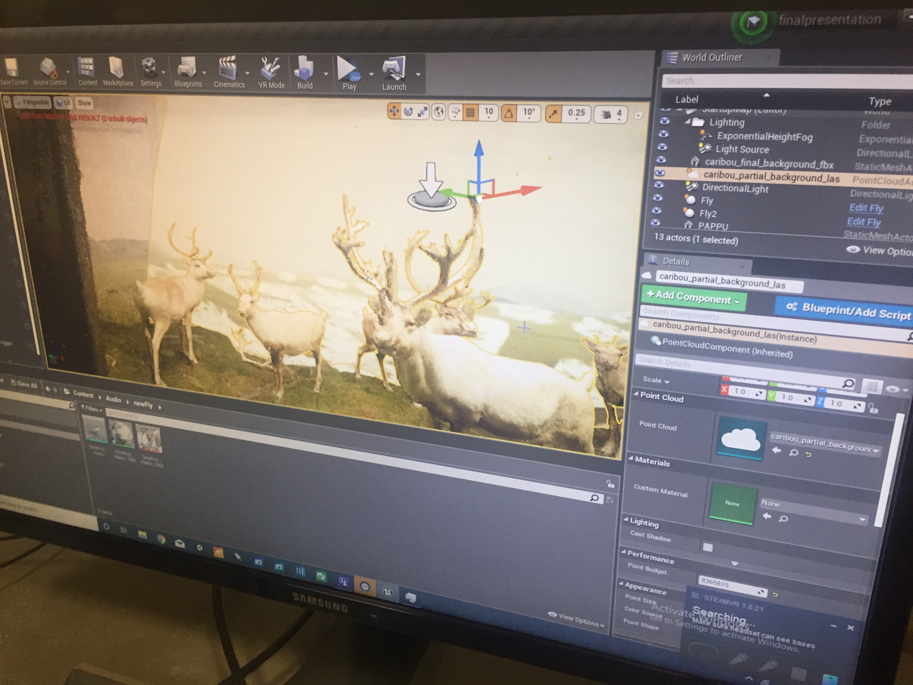
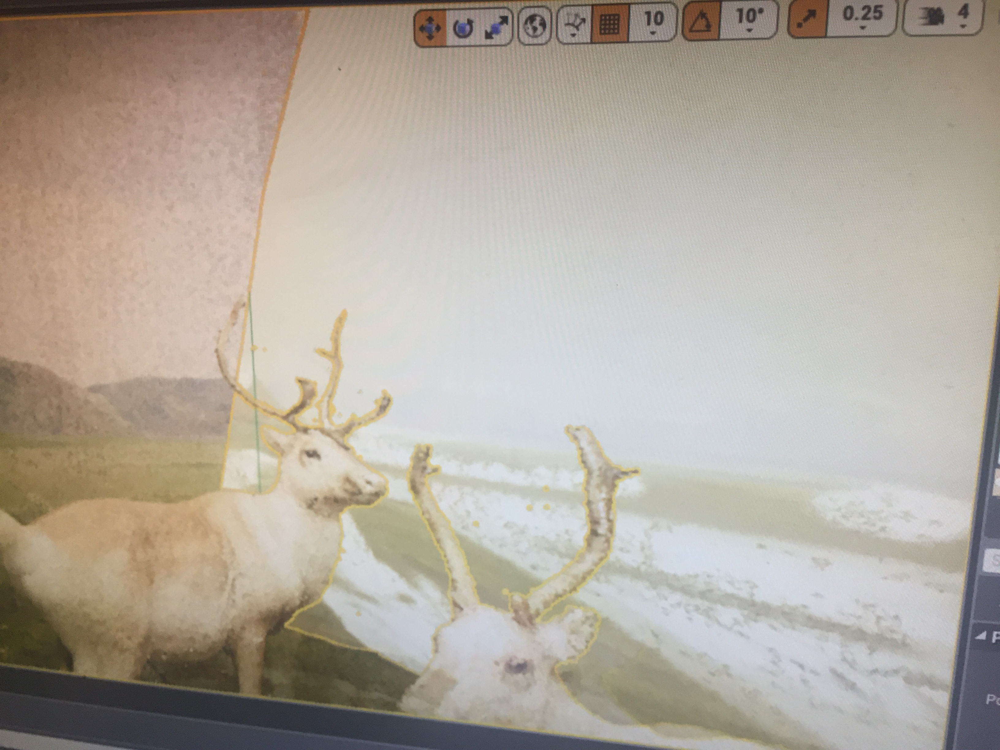

# Progress
Since this was the week of the final presentation, a significant amount of integration was completed.

- Migrated away for camera swapping to background hiding approach. Instead of alternating between cameras, we are hiding a background and making it visible at a certain time interval.

- A narrative dialogue was penned and recorded by the team. This narration is triggered when the viewer steps into the caribou diorama.

- The narration covers the story of the caribou & flies detailing the shift in balance due to climate change.

- The background scene changes from snow  to regular at a certain point in the narration.

- Apart from changing the background at the time, we also introduce mud and flies. The motivation behind this is to indicate the warmth of the environment.

- The below images depict the snow background integrated into the climate change scene.

